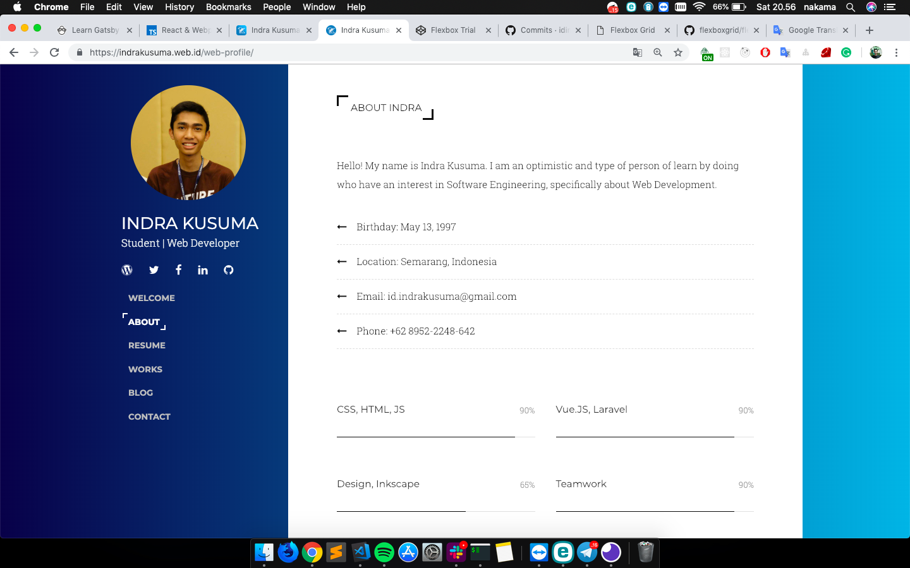

# Revamp Web Profile Indra Kusuma

Perkembangan teknologi yang begitu cepat menuntut kita sebagai Web Developer untuk selalu update mengenai berbagai tools maupun framework untuk optimasi dari web yang telah auatupun akan kita buat. Seperti web profile saya yang telah existing sebelumnya yang saya bangun menggunakan framework `Bootstrap`, `jQuery` serta `Gulp` akan saya refactor codenya dengan modern framework `ReactJS` dan `GatsbyJS` serta tools keren `Webpack` dan `EmotionJS`.

## Old to New

Berikut detail mengenai framework yang akan saya migrasi.

| Tools | Old Framework    | New Framework |
|-------|------------------|---------------|
| CSS Framework | Bootstrap | EmotionJs     |
| Js Framework | jQuery | ReactJs with GatsbyJS |
| Package Bundle | Gulp  | Webpack |
| Testing Library | -  | Jest & React Testing Library |

### Old Design

### New Design

Not ready yet.

## How to Run

Untuk menjalankan proyek ini, pastikan kamu komputermu sudah terinstal `Node.js`, `yarn`.

Dan berikut detail langkahnya:

1. Copy this repo to your local machine,
2. Install all dependencies with command `yarn install`.
3. Open link `http://localhost:8000` to your browser.

### Detail Command

| `yarn <command>` | Description |
------------------ | -------------
| `start` | serve your app at `localhost:8000` |
| `build` | build static page |
| `test` | run all unit test | 

### Create by

[Indra Kusuma](https://indrakusuma.web.id)  
*Latest update 18 Januari 2019*